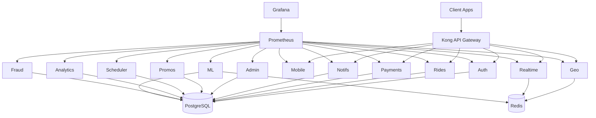

# Ride Hailing Platform

[](https://github.com/richxcame/ride-hailing/actions/workflows/ci.yml)
[](https://app.codecov.io/gh/richxcame/ride-hailing)

A ride-hailing platform backend built with Go, featuring 14 microservices.

## Services

| Service | Port | Description |
|---------|------|-------------|
| Auth | 8081 | JWT authentication, RBAC, key rotation |
| Rides | 8082 | Ride lifecycle, scheduling, surge pricing |
| Geo | 8083 | Driver locations, geospatial matching (Redis) |
| Payments | 8084 | Stripe integration, wallets, payouts |
| Notifications | 8085 | Firebase push, Twilio SMS, SMTP email |
| Realtime | 8086 | WebSocket events, in-app chat |
| Mobile | 8087 | Mobile-optimized API gateway |
| Admin | 8088 | Dashboard, user/driver management |
| Promos | 8089 | Promo codes, referral system |
| Scheduler | 8090 | Background jobs, scheduled rides |
| Analytics | 8091 | Business metrics, reporting |
| Fraud | 8092 | Fraud detection, risk scoring |
| ML ETA | 8093 | ML-based ETA prediction |
| Negotiation | 8094 | Fare negotiation |

## Tech Stack

- **Language**: Go 1.24+ / Gin
- **Database**: PostgreSQL 15 (connection pooling, read replicas)
- **Cache**: Redis 7 (GeoSpatial, Pub/Sub)
- **Payments**: Stripe
- **Notifications**: Firebase FCM, Twilio, SMTP
- **Observability**: Prometheus, Grafana, OpenTelemetry, Sentry, Zap
- **Infrastructure**: Docker, Kubernetes, Kong API Gateway, Istio
- **Resilience**: Circuit breakers, rate limiting, configurable timeouts

## Quick Start

### Prerequisites

- Docker and Docker Compose
- Go 1.24+

### Development (recommended)

```bash
# Start Postgres + Redis
make dev-infra

# Run migrations
make migrate-up

# Run a service
make run-auth   # or run-rides, run-geo, etc.
```

### Docker Compose

```bash
cp .env.example .env
docker-compose up -d
```

### Build all services

```bash
go build ./...
# Or individually:
go build -o bin/auth ./cmd/auth
```

## Configuration

Copy `.env.example` and adjust values. See [.env.example](.env.example) for all available environment variables with descriptions.

Key settings:
- `DB_*` - PostgreSQL connection
- `REDIS_*` - Redis connection
- `JWT_SECRET` - JWT signing key
- `STRIPE_API_KEY` - Stripe payments
- `FIREBASE_*` / `TWILIO_*` / `SMTP_*` - Notification channels
- `SECRETS_PROVIDER` - Secrets management (env, vault, aws, gcp, kubernetes)

## Architecture



## Testing

```bash
go test ./...                        # all tests
go test -cover ./...                 # with coverage
go test ./internal/auth/... -v       # specific service
go test ./test/integration/... -v    # integration tests
```

## Project Structure

```
ride-hailing/
├── cmd/                    # Service entry points (14 services)
├── internal/               # Business logic per domain
├── pkg/                    # Shared libraries (middleware, config, resilience, etc.)
├── db/migrations/          # Database migrations (18 migrations)
├── deploy/                 # OTel collector, Tempo config
├── k8s/                    # Kubernetes manifests
├── kong/                   # Kong API Gateway config
├── monitoring/             # Prometheus & Grafana config
├── test/                   # Integration tests, mocks, helpers
├── docs/                   # Documentation
├── docker-compose.yml      # Full stack
├── docker-compose.dev.yml  # Dev infrastructure only
└── Makefile                # Build, run, migrate commands
```

## Documentation

- [Quick Start Guide](docs/QUICKSTART.md)
- [Development Guide](docs/DEVELOPMENT.md)
- [API Reference](docs/API.md)
- [Deployment](docs/DEPLOYMENT.md)
- [Health Checks](docs/HEALTH_CHECKS.md)
- [Error Handling](docs/ERROR_HANDLING.md)
- [Observability](docs/observability.md)
- [Tracing Setup](docs/tracing-setup.md)
- [Database Operations](docs/DATABASE_OPERATIONS.md)
- [Disaster Recovery](docs/DISASTER_RECOVERY.md)
- [Sentry Setup](docs/SENTRY_QUICKSTART.md)

## License

MIT
